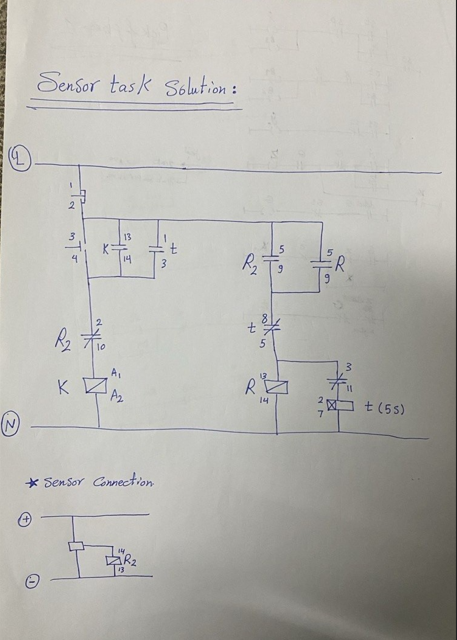

# Sensor-Based-Motor-Control-Classic-Control

## 📌 Project Overview

This project implements a **classic control circuit** for a motor using a **sensor and time delay logic**.

The system behavior follows these conditions:

* Pressing the **Start button** turns ON the motor.
* When the **sensor is activated**, the motor stops.
* When the sensor is released (not active), the motor restarts after **5 seconds delay**.
* Pressing **Start during the delay** should have no effect.
* Pressing **Stop** turns OFF the system immediately at any time.
* Sensor input before pressing Start should have no effect.

---

## ⚙️ Components Used

* Contactor (K)
* Overload Relay (R)
* Timer Relay (5s delay)
* Push Buttons (Start / Stop)
* Sensor (NO/NC based on design)
* Power Supply

---

## 🔌 Control Logic Explanation

The circuit is divided into:

### 1. Start/Stop Circuit

* Start button energizes the contactor (self-holding).
* Stop button breaks the circuit immediately.

### 2. Sensor Logic

* When sensor is triggered → motor stops.
* Sensor is interlocked with the control circuit to prevent unwanted startup.

### 3. Timer Logic

* When sensor is released → timer starts.
* After 5 seconds → motor restarts automatically.

---

## 🧠 Key Concepts

* Self-holding (latching circuit)
* Interlocking
* Timer ON delay
* Industrial control logic

---

## 📷 Circuit Diagram

---

## 🎥 Demo Video

(video.mp4)

---

## 🚀 How to Run (Hardware)

1. Connect components as shown in the diagram.
2. Power ON the system.
3. Press Start → motor runs.
4. Trigger sensor → motor stops.
5. Release sensor → motor restarts after 5 seconds.

---

## 💡 Notes

* Designed using **classic control (relay logic)**, not PLC.
* Can be extended to PLC (Ladder Logic) easily.

